# Kubernetes "Demo": Intro to Helm

## Goals

* Get familiar with higher-level IaC tools for K8s, helm in particular
* Install helm
* Develop a helm chart for our `todoapi` project
* Use the helm chart to deploy `todoapi` to our K8s cluster

## Concepts

### Helm

* What is helm? -- <https://helm.sh/>
* [Using helm](https://helm.sh/docs/intro/using_helm/)
* [The helm CLI](https://helm.sh/docs/helm/helm/)
* [Helm charts & templates](https://helm.sh/docs/chart_template_guide/getting_started/)

### Alternatives to helm

See e.g.

* [Kustomize](https://kubernetes.io/docs/tasks/manage-kubernetes-objects/kustomization/)
* the [Terraform Kubernetes provider](https://registry.terraform.io/providers/hashicorp/kubernetes/latest/docs)

## Lab

### 1. Setup

* [Install helm](https://helm.sh/docs/intro/install/) (if you haven't already)

* Use `helm version --short` to verify installation

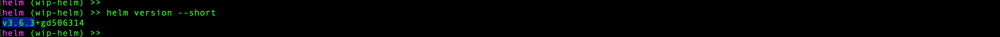

* To keep things simpler initially, we'll start developing our helm chart with the target namespace and the `dockerlogin` (Docker-repository login creds) and the `todoapi-configs` (DB username/password) secrets pre-deployed to that target namespace.
  We'll update that setup in Part 4, below.

***Note: The "final" version of the `todoapi` project with its completed helm charts and updated `build` folder, along with informative README files within the `build` folder, is included in the `master` branch at <https://github.com/itt-learning-groups/todoapi/tree/master/build>***

### 2. Create a helm chart from scratch

* Create the simplest initial version of a valid helm chart in `build/helm/chart_from_scratch`

      cd build
      mkdir helm && cd helm
      mkdir chart_from_scratch && cd chart_from_scratch
      mkdir todoapi && cd todoapi

  Then add a `Chart.yml` and `templates` directory:

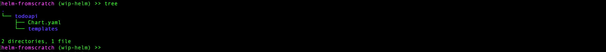

  ***Chart.yaml***

      apiVersion: v2
      name: todoapi
      description: Simple Go CRUD web app for todo tasks
      type: application
      version: 0.1.0
      appVersion: "1.0.0"

* Run
  * `helm lint todoapi`
  * `helm install todoapi --dry-run --debug ./todoapi -n dev`
  * `helm install todoapi ./todoapi -n dev`
  * `helm list -n dev`
  * `helm delete todoapi -n dev`

* Add a `configmap.yaml` to the templates directory and a `values.yaml` file:
  Note: We'll adopt a somewhat more standardized format for our resources labels/selectors than we used before.
  Note the use of helm's built-in `.Chart` and `.Release` template utilities, which come in handy here.

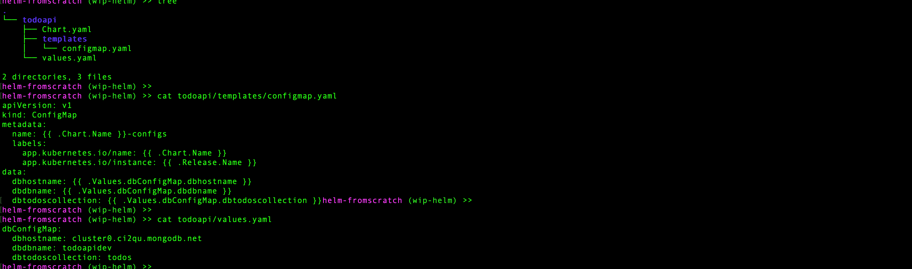

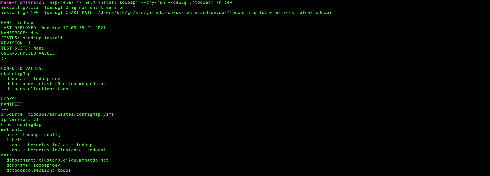

* Run
  * `helm lint todoapi`
  * `helm install todoapi --dry-run --debug ./todoapi -n dev`
  * `helm install todoapi ./todoapi -n dev`

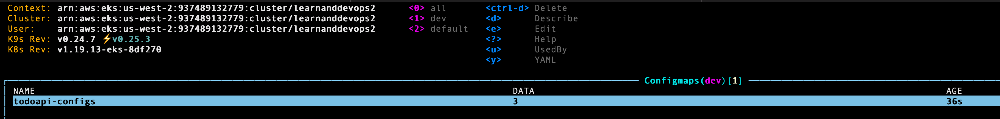

* Add a `deployment.yaml` to the templates and update the `values.yaml` to support it. We'll also update our `configmap.yaml` just to be clever.
  Note the use of helm's built-in `if` and `with` template functions, which come in handy here.
  Use helm lint and dry-run to inspect the changes.

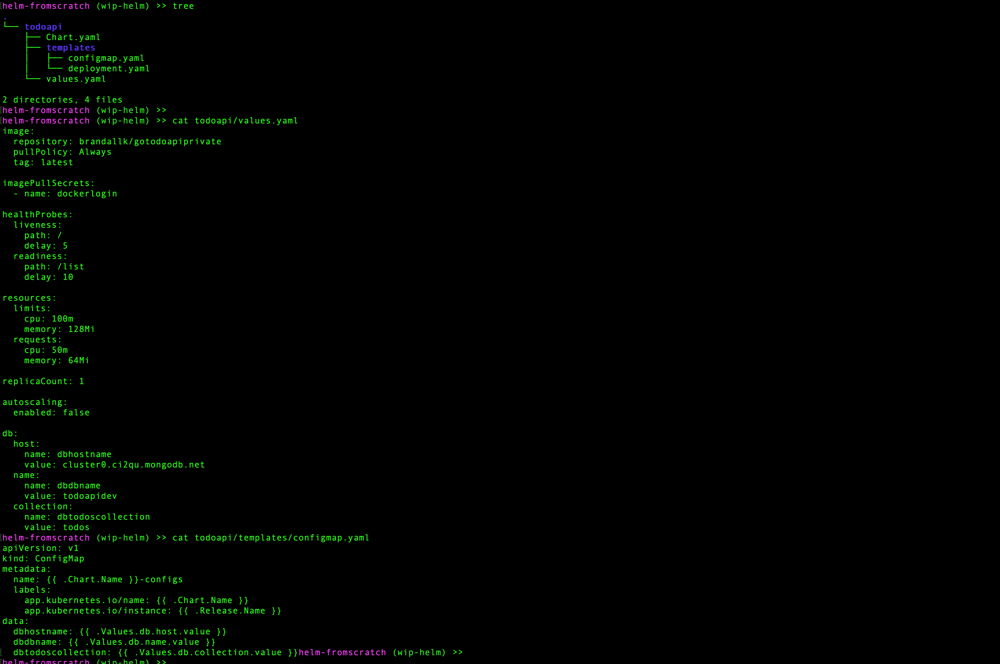

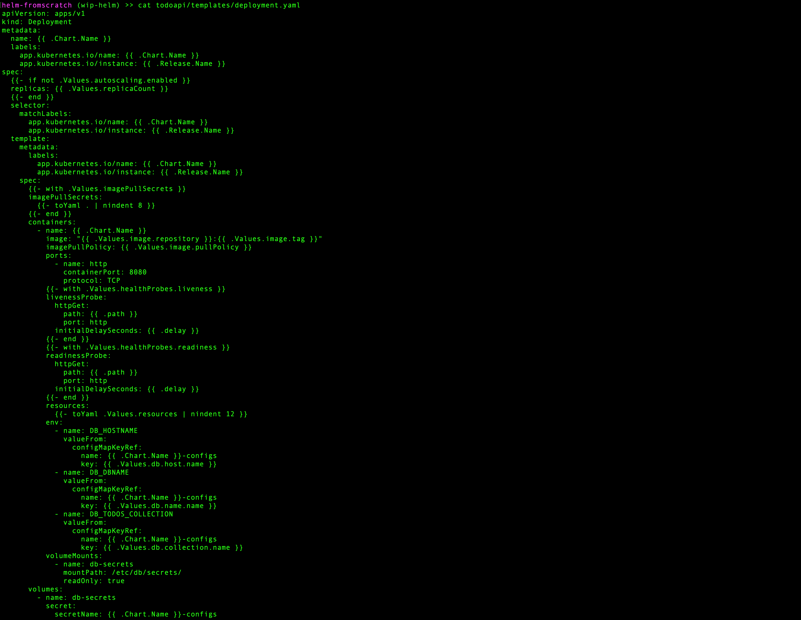

* Then run
  * `helm upgrade todoapi ./todoapi -n dev`

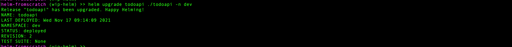

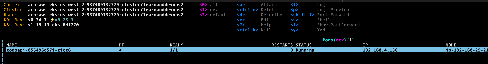

* Add a `service.yaml`, `ingress.yaml`, and `hpa.yaml` to the templates (in that order), updating the `values.yaml` to support them as you go.
  Note the use of helm's built-in `range` template function, and the ability to define local variables -- which comes in really handy with the `ingress.yaml`.
  Use helm lint and dry-run to inspect the changes.

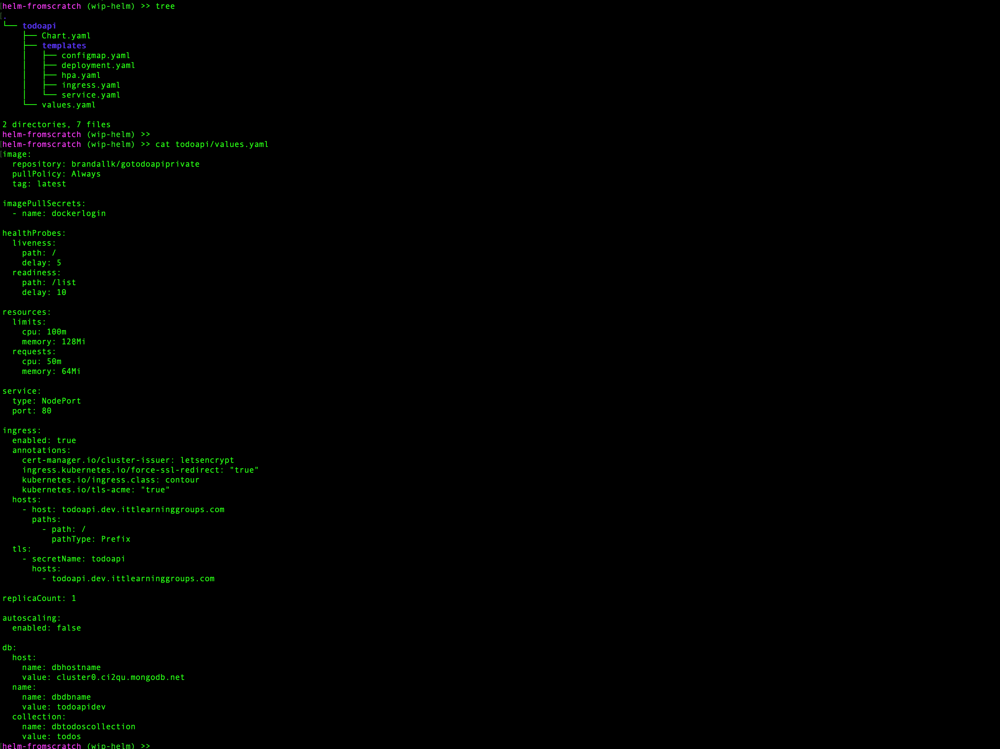

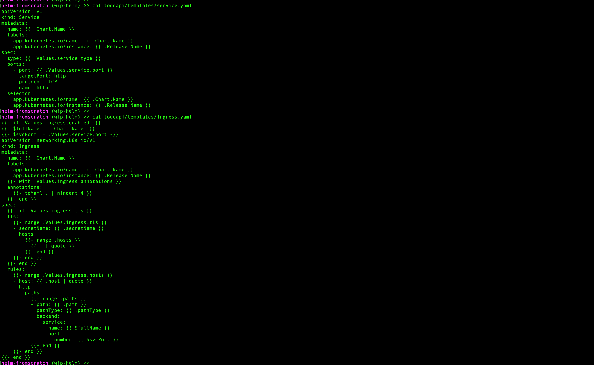

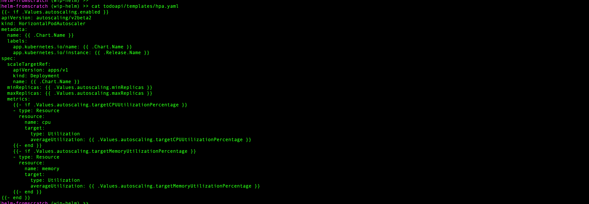

* Then run
  * `helm upgrade todoapi ./todoapi -n dev`

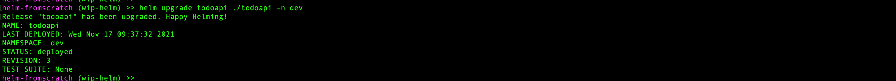

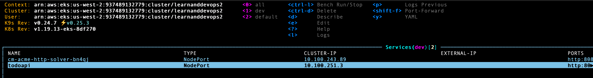

#### Deploying to multiple environments

So far, the helm chart works great for our `dev` environment. But what about our `qa` and `prod` environments?
We have a few values in `values.yaml` that will change depending on the environment. We don't want to have to maintain a separate `values.yaml` file for each environment.

There are other ways to set template values. We can also use the `--set` flag when running our helm install/upgrade command.
We'll use this strategy to set our 3 environment-dependent values.

But we have a problem to solve first.

Note that the following works for setting our DB name when we deploy to `qa`...

    helm upgrade --install todoapi ./todoapi --set 'db.name.value=todoapiqa' -n qa --dry-run --debug

...but if we try to set our ingress host and tls host, we run into trouble because using `--set` with a yaml array [is challenging](https://itnext.io/helm-chart-install-advanced-usage-of-the-set-argument-3e214b69c87a) unless the array element is a single string.
So this doesn't work:

    helm upgrade --install todoapi ./todoapi --set 'ingress.hosts[0].host=todoapi.qa.ittlearninggroups.com' -n dev --dry-run --debug

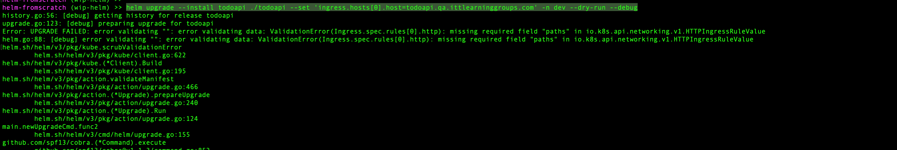

We could force this strategy to work if we had no other option, but it would get ugly. And we do have other options:

**Option 1:** We could abstract the "dev/qa/prod" part of the relevant string variables to its own variable. In our case, this also would become ugly, but it would work.

**Option 2:** Since we are actually only using a single array element for both our ingress hosts and tls secrets, we can just switch to using a map object for `ingress.hosts` and `ingress.tls`. This doesn't match the structure in our `ingress.yaml` template, but that's OK: We have the freedom to structure our `values.yaml` file in whatever way best suits our needs:

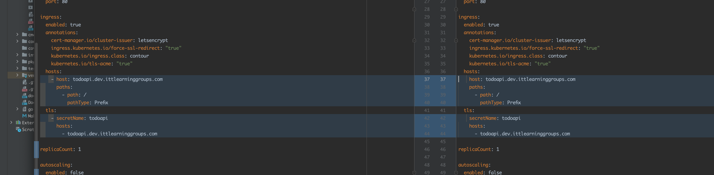

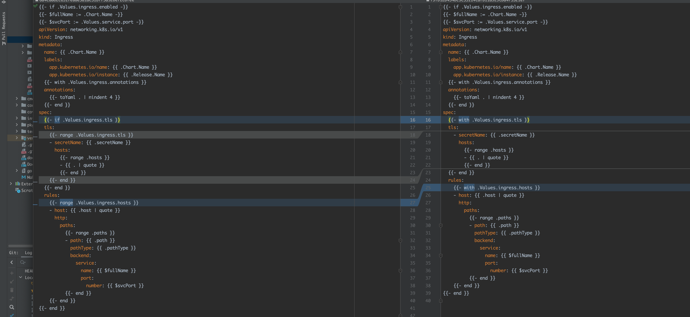

Now we can run the following to deploy to `qa`:

    helm upgrade --install todoapi ./todoapi --set 'ingress.hosts.host=todoapi.qa.ittlearninggroups.com' --set 'ingress.tls.hosts={todoapi.qa.ittlearninggroups.com}' --set 'db.name.value=todoapiqa' -n qa

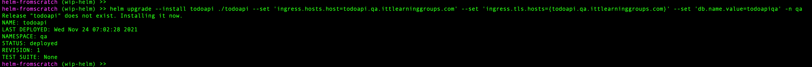

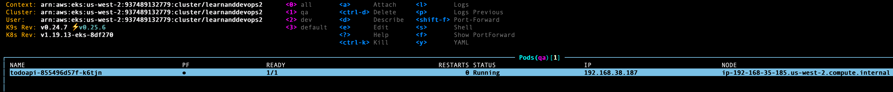

### 3. Create a helm chart using the helm starter

* Create the chart scaffold in `build/helm/chart_from_helm_starter`

    cd build
    mkdir helm && cd helm
    mkdir chart_from_helm_starter && cd chart_from_helm_starter
    helm create todoapi

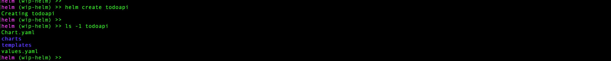

* You can then adapt the starter templates to create the equivalent of the helm chart we just built from "scratch".
  This is arguably easier.
  It also allows you to take advantage of some more-sophisticated options you'll find pre-built into these templates that we didn't use in our from-scratch version because the start templates include a set of `_helper.tpl` utilities.

### 4. Add secrets and a namespace to our helm release

* Set your image-registry and DB credentials as environment variables so you can use them in `--set` options when running the helm install/upgrade. We'll use our `prod` environment as an example:
  * export DOCKER_SERVER=...
  * export DOCKER_USERNAME=...
  * export DOCKER_PSWD=...
  * export DOCKER_EMAIL=...
  * export DB_USERNAME=...
  * export DB_PSWD_PROD=...

* Add empty placeholders for these values to your `values.yaml` file:

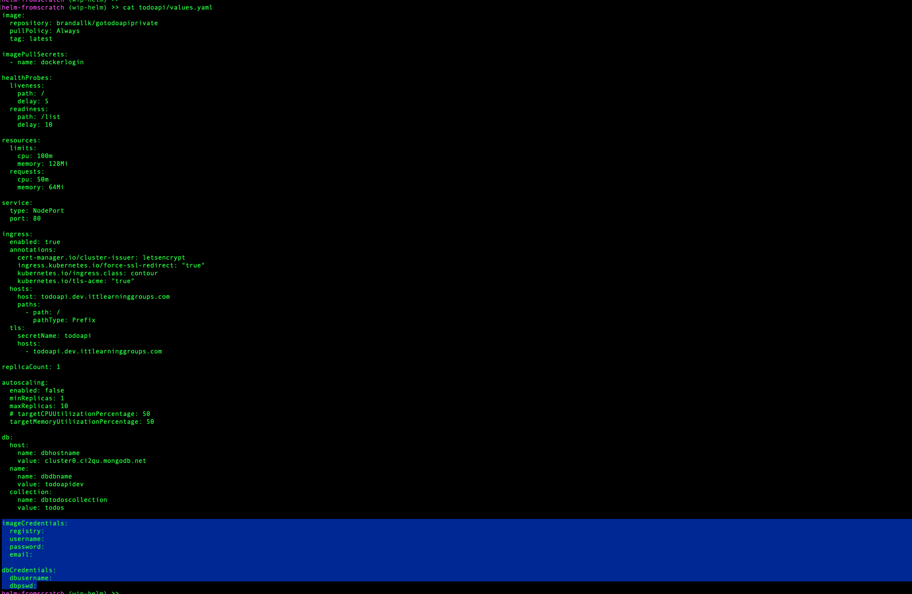

* Add a k8s secrets template for each secret:

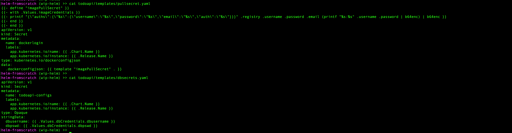

* Now we can deploy to `prod` without already having these secrets in place; helm will do it for us.
  We can also ask helm to create the `prod` namespace if it doesn't already exist, by using the `--create-namespace` option:

      helm upgrade --install todoapi ./todoapi \
        --create-namespace \
        --set 'ingress.hosts.host=todoapi.prod.ittlearninggroups.com' \
        --set 'ingress.tls.hosts={todoapi.prod.ittlearninggroups.com}' \
        --set 'db.name.value=todoapiprod' \
        --set "imageCredentials.registry=${DOCKER_SERVER}" \
        --set "imageCredentials.username=${DOCKER_USERNAME}" \
        --set "imageCredentials.password=${DOCKER_PSWD}" \
        --set "imageCredentials.email=${DOCKER_EMAIL}" \
        --set "dbCredentials.dbusername=${DB_USERNAME}" \
        --set "dbCredentials.dbpswd=${DB_PSWD_PROD}" \
        -n prod

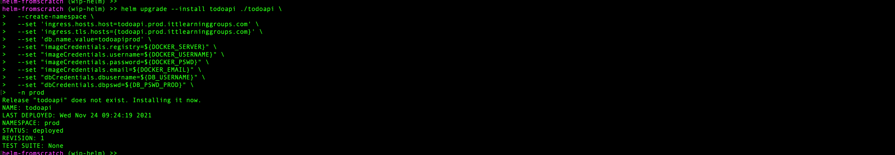

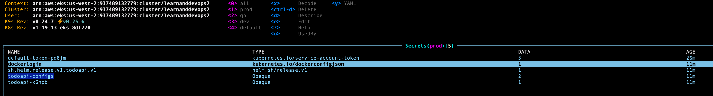

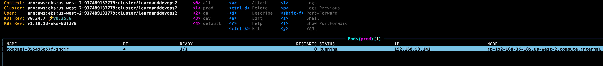
